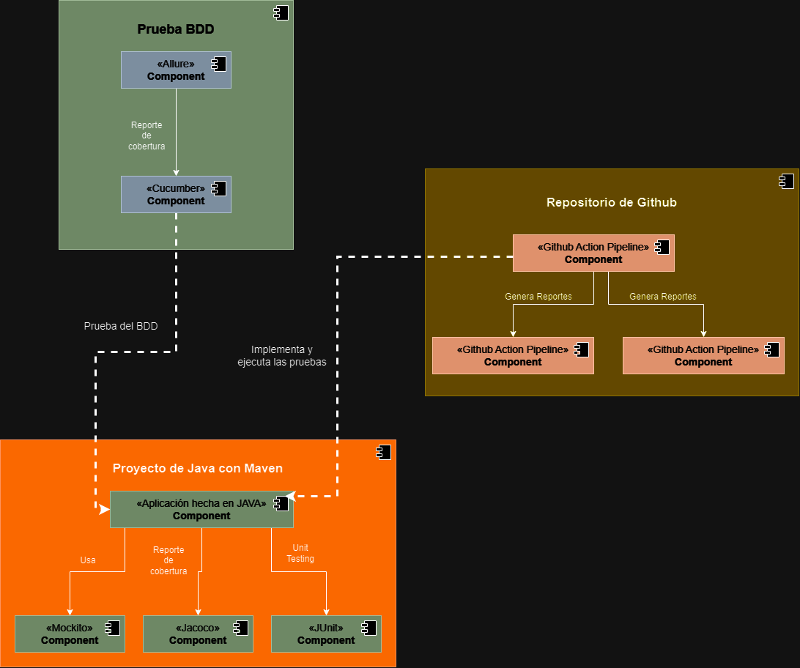
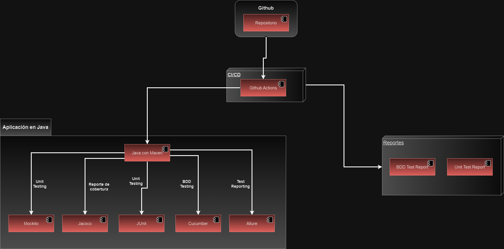
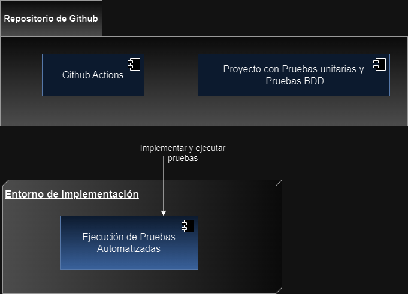

# FACULTAD DE INGENIERÍA
## _Escuela Profesional de Ingenieria de Sistemas_

## Nombre del trabajo: "Proyecto Grupal de la Unidad 3"
## Titulo del proyecto: **"Desplegación de las pruebas automatizadass en una solución de 
## **gestión de pruebas (GithubActions)-Pruebas Unitarias y Pruebas BDD"**
##
## Docente: **_Ing. Patrick Cuadros Quiroga_**
## Integrantes:
| Nº | Código Universitario | Apellidos y Nombres |
|----|----------------------|---------------------|
| 1. | 2020066920           | Valverde Zamora, Jean Pier Elias |
| 2. | 2020067148           | Jarro Cachi, Jose Luis |
| 3. | 2020067573           | Cano Susco, Anthony Alexander |
| 4. | 2017057528           | Ccalli Chata, Joel Robert |
| 5. | 2020067145           | Anahua Coaquira, Mayner Gonzalo |
***
## Diagrama de Componentes:

## Diagrama de Arquitectura:

## Diagrama de Despliegue:

